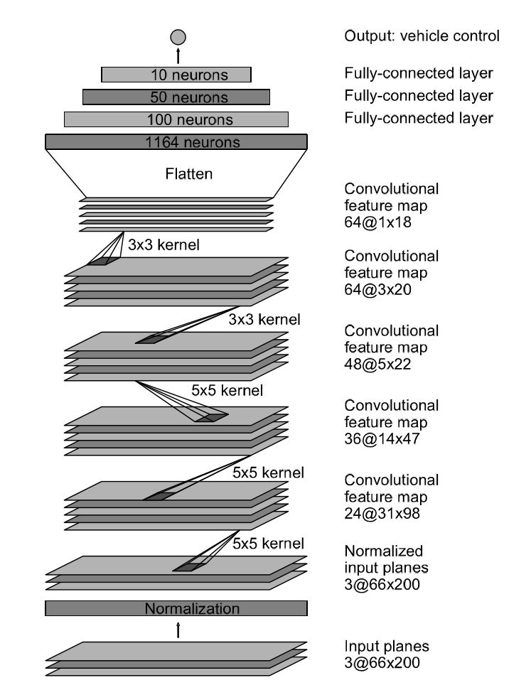
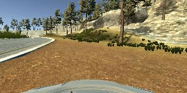
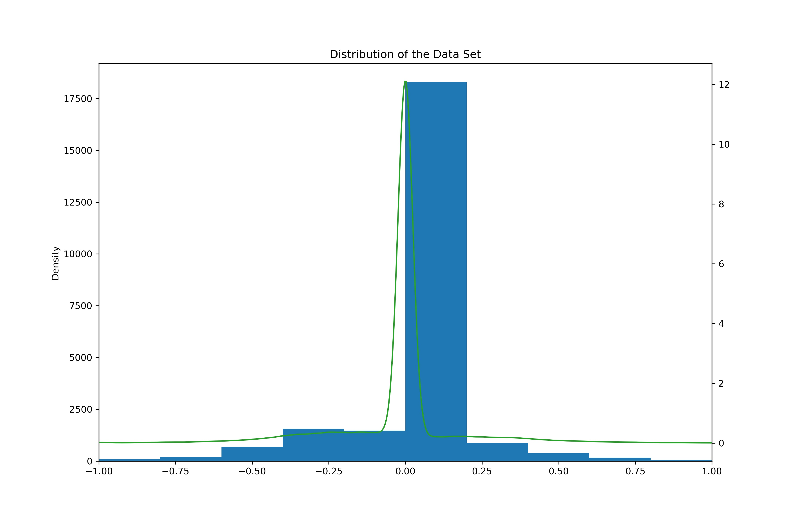
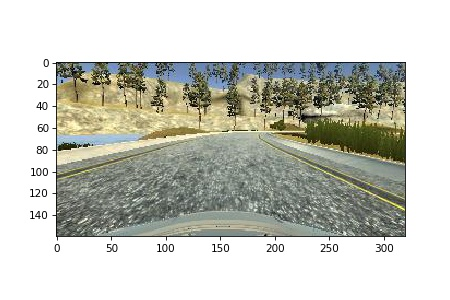
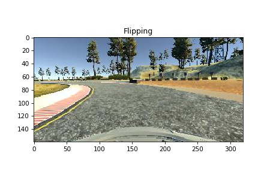
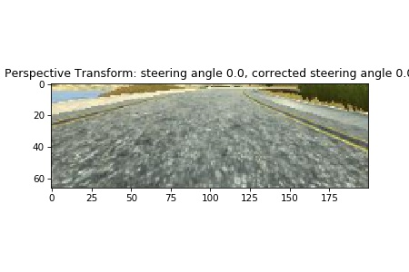
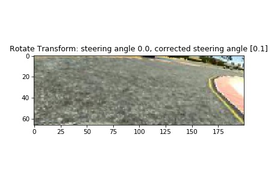
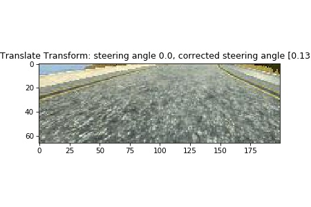
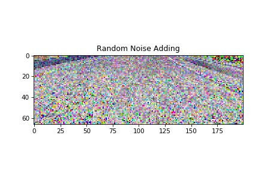
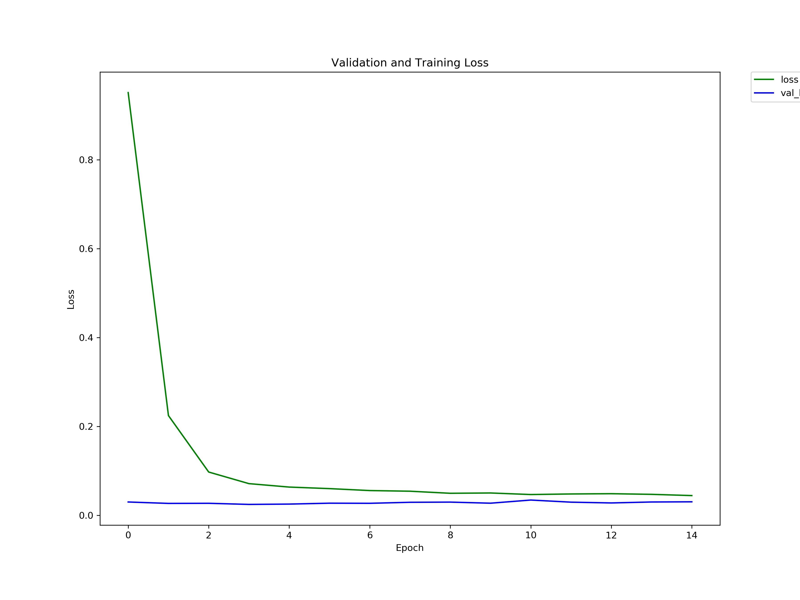

# **Behavioral Cloning** 
---

Pongrut Palarpong  
April 16, 2018

---

**Behavioral Cloning Project**

The goals / steps of this project are the following:
* Use the simulator to collect data of good driving behavior
* Build, a convolution neural network in Keras that predicts steering angles from images
* Train and validate the model with a training and validation set
* Test that the model successfully drives around track one without leaving the road
* Summarize the results with a written report

[//]: # (Image References)

[image1]: ./examples/placeholder.png "Model Visualization"
[image2]: ./examples/placeholder.png "Grayscaling"
[image3]: ./examples/placeholder_small.png "Recovery Image"
[image4]: ./examples/placeholder_small.png "Recovery Image"
[image5]: ./examples/placeholder_small.png "Recovery Image"
[image6]: ./examples/placeholder_small.png "Normal Image"
[image7]: ./examples/placeholder_small.png "Flipped Image"

## Rubric Points
### Here I will consider the [rubric points](https://review.udacity.com/#!/rubrics/432/view) individually and describe how I addressed each point in my implementation.  

---

### Model Architecture and Training Strategy

#### 1. An appropriate model architecture has been employed

My model consists of 1 Cropping2D layer for cropping input images to 75x320x3 shape and 2 Keras lamda layers for resizing to 66x200x3 and then zero-mean normalization. There are five convolution neural layers with 5x5 and 3x3 filter sizes and depths between 24 and 64 (model.py lines 385-394) then the Flatten layer, after that four fully connected layer and finally the output layer (code lines 395-406).

The model includes elu layers to introduce nonlinearity, and the input data of each layer is normalized by Batch normalization layers to reduce the amount by what the hidden unit values shift around (covariance shift). 

Ref:
[Batch Normalization: Accelerating Deep Network Training by Reducing Internal Covariate Shift](https://arxiv.org/abs/1502.03167)

#### 2. Attempts to reduce overfitting in the model

The model contains dropout layers in order to reduce overfitting (model.py lines 396, 405). 
In image augmentation processes, it have a process of adding noise to inputs randomly like to forcing the network to not change the output in the wide range of inputs, and also contains the poor driving behavior training dataset so the model can learn variety inputs that generate the same output. These adds robustness against overfitting to the model.

The model was trained and validated on different datasets to ensure that the model was not overfitting (code line 542). The model was tested by running it through the simulator and ensuring that the vehicle could stay on the track.

#### 3. Model parameter tuning

The model used an adam optimizer with default learning rate, so the learning rate was not tuned manually (model.py line 447).

|     Hyper Parameters      |     Value      |                      Remark                    | 
|:--------------------------|:--------------:| :----------------------------------------------| 
| Epochs                    |       15  	   | Normal case 10 epochs should be enough         |
| Learning Rate             |      0.001 	   | default value of Adam optimizer                |
| Batch Size                |       32   	   | It can be increase depend on computer resource |
| Matric                    |      Loss  	   | Steering angle is continuous number, the accuracy is not appropriate for measurement |
| Loss Type                 |       MSE      | Mean Squared Error                             |
| Optimizer                 |      Adam      | Benefit from adaptive learning rate            |

#### 4. Appropriate training data

Training data was chosen to keep the vehicle driving on the road. 
I used a combination of center lane driving at low speed, driving at max speed and try to control the vehicle in the lane, making with poor driving behavior, recovering from the left of the road, and focusing on curvatures situations. The driving logs did in both counterclockwise and clockwise directions

For details about how I created the training data, see the next section. 

### Model Architecture and Training Strategy

#### 1. Solution Design Approach

The overall strategy for deriving a model architecture was to adopt proved convolutional neural network (CNN) model architecture to train on image datasets from driving simulator. The objective of the model is to map raw pixels from 3 front-facing cameras (center, left, right) and predict appropreated steering commands.

My first step was to use a convolution neural network model similar to the NVidia CNN Model Architecture I thought this model might be appropriate because it is an end-to-end approach that proves effective. With the minimum training information from human systems.
Learn to drive in local street traffic with or without a marker and on highways.

In order to gauge how well the model was working, I split my image and steering angle data into a training and validation set. I found that my first model had a low mean squared error on the training set but a high mean squared error on the validation set. This implied that the model was overfitting. 

To combat the overfitting, I modified the model so that To combat the overfitting, I modified the model so that added dropout layers that can reduce the validation loss. However, gap between loss in training and validation is still significant difference, which shows that the model can not generalize enough to handle new inputs.Thus, I tried to add more datasets, including bad driving behavior, and the vehicle recovering from the side road into the final datasets.

The final step was to run the simulator to see how well the car was driving around track one. There were a curvature spots where the vehicle fell off the track to improve the driving behavior in these cases, I added and image augmentations process in data preprocessing step and also record more data on specific weak spots. 

At the end of the process, the vehicle is able to drive autonomously around the track without leaving the road.

#### 2. Final Model Architecture

The final model architecture (model.py lines 370-408) consisted of a convolution neural network with the following layers as shown below.

| Layer         		                          |     Description	        			            		| 
|:-------------------------------------------|:---------------------------------------------:| 
| Input         	                      	    | 160x320x3 RGB image   					          		| 
| cropping2d_1 (Cropping2D)                 	| cropping=((69,25), (60,60)),  outputs 75x320x3 	|
| lambda_1 (Normalization & Zero Mean)      	| outputs 66x200x3                            	|
| conv2d_1 (Convolution 5x5)	                | 2x2 stride, elu activation, outputs 31x98x24  |
| batch_normalization_1 (Batch Normalization) | outputs 31x98x24                              |
| conv2d_2 (Convolution 5x5)	                | 2x2 stride, elu activation, outputs 14x47x36  |
| batch_normalization_2 (Batch Normalization) | outputs 14x47x36                              |
| conv2d_3 (Convolution 5x5)	                | 2x2 stride, elu activation, outputs 5x22x48   |
| batch_normalization_3 (Batch Normalization) | outputs 5x22x48                               |
| conv2d_4 (Convolution 3x3)	                | elu activation, outputs 3x20x64               |
| batch_normalization_4 (Batch Normalization) | outputs 3x20x64                               |
| conv2d_5 (Convolution 3x3)	                | elu activation, outputs 1x18x64               |
| batch_normalization_5 (Batch Normalization) | outputs 1x18x64                               |
| flatten_1 (Flatten)         		            | outputs 1152       						          			|
| dropout_1 (Dropout)         			      		| outputs 1152                                	|
| dense_1 (Dense)             			      		| elu activation, outputs 1164                  |
| batch_normalization_6 (Batch Normalization) | outputs 1164                                  |
| dense_2 (Dense)             			      		| elu activation, outputs 100                   |
| batch_normalization_7 (Batch Normalization) | outputs 100                                   |
| dense_3 (Dense)             			      		| elu activation, outputs 50                    |
| batch_normalization_8 (Batch Normalization) | outputs 50                                    |
| dense_4 (Dense)             			      		| elu activation, outputs 10                    |
| batch_normalization_9 (Batch Normalization) | outputs 10                                    |
| dropout_2 (Dropout)         			      		| outputs 10                                  	|
| dense_5 (Dense)             			      		| outputs 1                                   	|
|					            	|											|
|				            		|											|

Here is a visualization of the architecture:

[NVidia CNN Model Architecture](https://images.nvidia.com/content/tegra/automotive/images/2016/solutions/pdf/end-to-end-dl-using-px.pdf)

#### 3. Creation of the Training Set & Training Process

To capture good driving behavior, I first recorded two laps on track one using center lane driving. 
Here is an example images of center lane driving:

  
Normal driving behavior of both directions.   
  
Poor driving behavior.    
 
Fix curvature road driving.  

I then recorded the vehicle recovering from the left side of the road back to center so that the vehicle would learn to recover when it off the track. This images show what a recovery looks like starting from side track and back to the road:

Histogram of 23,790 steering angles and Density curve.

To augment the dataset, I used the transformation_pipline function for processing image augmentations as in table below:

|         Augment Methods         |                                 Description                                    | 
|:--------------------------------| :------------------------------------------------------------------------------| 
| Flip                            | Flip center view to left and right view and then correct steering angle        |
| Random Perspective Transform    | Ramdomly perform perspective transformation                                    |
| Random Rotate                   | Ramdomly perform rotation transformation                                       |
| Random Translate                | Ramdomly perform shift transformation                                          |
| Random Noise Adding             | Ramdomly perform noise adding                                                  |

 

 
 

Flip view: corrected steering angle -steering angle
 
 

Random Perspective Transform: corrected steering angle: -1.0°
 
 

Random Rotate Transform: corrected steering angle: -1.0°
 
 

Random Translate Transform: corrected steering angle: -1.0°
 
 

Random Noise Adding: corrected steering angle: -1.0°
 

Etc ....

I finally randomly shuffled the dataset and put 20% of the data into a validation set.

After the preserved 20% of data for validation set, I had 19,032 number of training data points. 
I then preprocessed this data by using generator function. The generator performs image augmentation for each batch then pass the data to do image cropping and zero mean normailzation in first 2 layers of the network.

 

I used this training data for training the model. The validation set helped determine if the model was over or under fitting. The ideal number of epochs was 10 as evidenced by the val_loss and loss seem to converge at 10 epochs which shown in the chart below. I used an adam optimizer so that manually training the learning rate wasn't necessary.

Validation Loss vs. Training Loss during training process.
